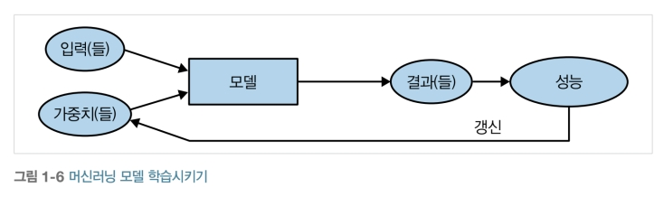

Date: 2024-04-12
Tag: moment
    dayjs
Status: pub

# 다시 1장으로

책을 다 안 봤지만 1장으로 다시 돌아가자.

## 질문지

1. 딥러닝에 다음과 같은 사항이 필요한가요?

* 뛰어난 수학 지식 (참/거짓): 거짓; 고등학교 수준의 수학이면 충분하다
* 많은 양의 데이터 (참/거짓): 거짓; 50개 미만의 데이터로도 충분히 의미 있는 결과를 만들 수 있다
* 고가의 컴퓨터 (참/거짓): 거짓; 큰 비용을 들이지 않고도 최신 결과를 얻을 수 있다
* 박사 학위 (참/거짓); 거짓; 박사학위가 필요하지 않다. 인공뉴런 개념을 제시한 월터 피츠는 평생 어떤 고등 학위나 권위적인 직책도 없었다. 또한 5,000번 이상 인용되었으며 지난 10년간 큰 영향력을 미친 [Unsupervised Representation Learning with Deep Convolutional Generative Adversarial Networks](https://oreil.ly/JV6rL) 논문은 알렉 래드포드(Alec Redford)가 학부 시절에 썼다. 그리고 일론 머스크는 

> 박사 학위는 필수가 아닙니다. AI를 깊이 이해하고 실제로 유용한 신경망을 구현하는 능력이 중요하죠. 고등학교만 졸업했더라도 전혀 상관이 없습니다.

라고 했다.

2. 현재 딥러닝이 세계 최고의 도구로 자리매김한 다섯 가지 영역은 무엇인가요?

- 자연어 처리(NLP)
- 영상 처리
- 이미지 생성
- 추천 시스템
- 게임

3. 인공 뉴런의 원리에 기반한 첫 번째 장치의 이름은 무엇인가요?

신경 생리학자 워렌 매컬러(Warren McCulloch)와 논리학자 월터 피츠(Walter Pits)가 제안한 인공 뉴런의 수학적 원리를 기반으로 심리학자 로젠블렛(Frank Rosenblatt)가 인공 뉴런 개념을 더욱 발전시켜 학습하는 능력을 부여했다. 이 원칙을 사용한 최초의 장치인 __'마크 원 퍼셉트론(Mark I Perceptron)'__을 만들었다.

4. 병렬 분산 처리(PDP)에 대한 요구 사항은 무엇인가요?

PDP가 제시한 접근법은 오늘날 신경망에서 사용하는 접근법과 매우 유사하다. PDP는 병렬 분산 처리를 다음과 같이 정의했다.

- **처리 유닛** 집합
- **활성 상태**
- 각 유닛의 **출력 함수**
- 유닛 간의 **연결 패턴**
- 연결망으로 활동 패턴을 전파하는 **전파 규칙**
- 유닛의 현재 상태에 영향을 주는 입력을 결합하여 유닛의 출력을 생성하는 **활성화 규칙**
- 경험에 따라 연결 패턴을 바꾸는 **학습 규칙**
- 시스템이 동작하는 **환경**

5. 신경망 분야의 발전을 저해하는 두 가지 이론적 오해는 무엇인가요?

MIT의 교수 마빈 민스키(Marvin Minsky)와 시모어 페퍼트(Semour Papert)는 저서 Perceptrons(MIT Press, 1987)에서 로젠블렛의 발명을 언급했는데, 해당 장치로 구성된 단일 계층은 XOR 같이 간단하지만 수학적으로 매우 중요한 개념을 학습해내지 못한다는 사실을 밝혔다. 또한 에러 계층을 사용하면 이 문제를 해결할 수 있다는 사실을 증명했지만 XOR을 학습해내지 못한다는 사실만 사람들에게 널리 알려져 그 후 20년 동안 학계가 신경망을 포기하게 되었다.

단일 뉴런 계층을 추가한 신경망은 모든 수학적 함수를 근사할 수 있지만, 실제로 사용되기 위해서는 너무나도 많은 뉴런이 필요해서 전체 신경망이 너무 커지고 매우 느려질 수 있다는 사실로 인해 오랫동안 신경망 분야가 외면되게 되었다.

6. GPU란 무엇인가요?

**그래픽 카드(graphics card)**라고도 알려진 GPU는 수천 개의 단일 작업을 동시에 처리할 수 있는 특별한 프로세서로, 특히 컴퓨터에서 3D 환경의 게임을 출력하는 목적으로 설계되었다. 이런 기본 작업은 신경망이 수행하는 작업과 매우 유사하다. 따라서 GPU는 CPU보다 수백 배 빠르게 신경망을 처리한다. 현대의 컴퓨터에는 대부분 GPU가 탑재되지만, 딥러닝에 적합한 종류의 GPU는 아닐 때가 더 많다.

7. 노트북을 열고 1+1 코드를 담은 셀을 실행해보세요. 어떤 일이 일어나나요?

출력 셀에 2가 표시된다.

8. 이 장에 해당하는 출력이 제거된 버전의 노트북을 살펴보고, 각 셀을 실행하기 전에 일어날 일을 추측해보세요.

Yes!

9. 주피터 노트북의 사용법을 다룬 온라인 부록[(https://oreil.ly/9uPZe)](https://oreil.ly/9uPZe)을 읽어보세요.

Yes!!

10. 전통적인 컴퓨터 프로그램으로 이미지를 인식하는 작업이 어려운 이유는 무엇인가요?

컴퓨터는 두뇌가 작동하는 방식과 매우 다른 방식으로 동작하므로 일반적인 컴퓨터 프로그램에서 이미지를 인식하는 작업은 어렵게 된다.

11. 사무엘이 '가중치 할당'으로 의미한 바는 무엇인가요?

모델(프로그램)이 우리가 원하는 결과를 내기 위해서 정의하는 다른 값. 다른 가중치를 사용하면 다른 결과를 내는 모델을 만들 수 있다.

12. 사무엘이 말한 '가중치'에 대응하는 일반적인 딥러닝 용어는 무엇인가요?

파라미터(parameter)

13. 머신러닝 모델에 대한 사무엘의 견해를 그림 한 장으로 요약해보세요.

14. 딥러닝 모델이 내놓은 특정 예측 결과의 이유를 이해하기는 왜 어려운가요?

모델이 문제해결에 대한 자세한 과정을 알 수 없고, 복잡한 계산을 통해 결과를 내놓기 때문에 이 결과에 대한 이유를 이해하기 어렵다.

15. 신경망이 모든 수준의 정확도로 모든 수학적 문제를 해결할 수 있음을 보여주는 정리의 이름은 무엇인가요?

일반 근사 정리(universal approximation theorem)

16. 모델을 학습시키려면 무엇이 필요한가요?

데이터와 데이터에 대한 레이블

17. 피드백 루프는 예측 치안 유지 모델에 어떤 영향을 미치나요?

모델이 작동한 결과 특정한 지역의 범죄 모니터링을 더 하게 되고, 범죄의 발생을 더 많이 확인하게 된다. 그 결과가 모델에 반영이 되어 해당 지역에 대해 더 높은 범죄율을 예측하게 되고, 이것이 반복되어 실제보다 더 높은 편향된 결과를 내놓게 된다. 

18. 고양이 인식 모델에는 항상 224 x 224 픽셀 크기의 이미지를 사용해야만 하나요?

아니오. 224픽셀을 사용한 이유는 영상 처리 분야의 역사적인 이유 때문에 사용된 것으로, 영상 처리 분야에서 흔히 사용되는 표준적인 크기이기 때문이다. 다른 크기의 이미지도 사용할 수 있지만, 크기가 커지면 더 나은 결과가 나올 수도 있지만, 속도와 메모리 소비량을 희생해야 한다. 그 반대로 크기가 작아지면 속도와 메모리 소비량에서 이점을 갖는 대신 결과가 나빠질 수 있다.

19. 분류와 회귀는 어떻게 다른가요?

분류(classification)와 회귀(regression)는 머신러닝에서 명확한 의미를 가진다. 분류 모델이란 클래스나 범주를 예측하는 모델로 '개'나 '고양이' 처럼 여러 이산적인(서로 독립적인) 가능성을 예측한다. 반면 회귀 모델은 온도, 위치와 같은 하나 이상의 수치형 수량을 예측하는 모델이다.

20. 검증용 데이터셋과 테스트용 데이터셋이란 무엇인가요? 왜 필요한가요?

모델 학습에 사용되지 않고, 모델의 정확도를 평가하기 위한 데이터를 검증용 데이터셋이라 한다. 검증용 데이터셋은 모델의 학습에는 사용되지 않지만, 모델의 성능을 개선하기 위해 잠재적으로 사용되므로 검증용 데이터셋에 의해서도 과적합이 발생할 수 있다. 그래서 이를 보완하기 위해 모델과 검증하는 사람 또는 알 수 없는 테스트용 데이터셋을 둬 모델의 성능을 좀 더 객관적으로 평가하게 된다. 

21. 검증용 데이터셋을 명시적으로 제공하지 않을 때 fastai는 어떤 조치를 취하나요?

valid_pct 인자를 0.2로 설정하여, 자동으로 검증용 데이터셋이 구성하게 한다.

22. 항상 임의로 추출한 표본만으로도 검증용 데이터셋을 구축할 수 있나요? 그렇다면, 또는 그렇지 않다면 그 이유는 무엇인가요?

아니오. 시계열 데이터(시간에 흐름에 따라 변함) 처럼 데이터가 서로 연관이 있을 경우에는 임의로 표본을 추출하게 되면 예측이 너무 쉬워지거나, 의미가 없는 데이터셋이 구성되게 된다. 

23. 과적합이란 무엇인가요? 예를 들어 설명해보세요.

모델이 훈련 데이터에 대해서만 좋은 성능을 내는 것. 사진을 가지고 행동을 추론하는 모델을 구성할 때 사진이 한 사람의 행동 데이터로 학습한다면, 일반적인 사람들의 행동 패턴보다 학습한 사람의 특성을 학습하게 되는 상황이 된다는 것

24. 평가지표란 무엇인가요? 손실과는 어떻게 다른 가요?

검증용 데이터셋을 사용해 모델이 내놓은 예측의 품질을 측정하는 함수로 손실이 학습 시스템이 가중치를 자동으로 갱신하는데 사용하는 것과는 

25. 사전 학습된 모델은 어떤 면에서 도움이 되나요?

전문가가 신중히 구성한 범주로 다른 데이터셋을 통해 이미 학습된 가중치가 있기 때문에, 학습용 데이터가 전혀 준비되지 않은 상황에서도 유능하다.

26. 모델의 '머리'란 무엇인가요?

머리는 모델의 마지막 계층으로, 보통은 모델이 원하는 작업(예: 이미지넷 데이터셋 분류)에 특별히 만도록 정희한 부분이다. 사전 학습된 모델을 사용해 학습할 경우 이 머리 부분을 제거하고 원하는 작업을 할 수 있게끔 가중치를 조절한 계층으로 교체한다.

27. CNN의 초기 계층은 어떤 종류의 특징을 찾아내나요? 후기 계층은 어떤가요?

초기 계층은 대각선, 수평선, 수직선, 그라데이션, 반복적인 선, 원 등의 단순한 특징들을 찾다가 계층이 진행 될 수록 자동차 바퀴, 텍스트, 꽃잎 등 고차원적 특징을 찾아낸다.

28. 이미지 모델은 사진에만 유용한가요?

사진 뿐만 아니라 음향을 이미지 형식으로 나타내거나, 행동 패턴에 대한 마우스의 움직임 이미지, 악성코드를 시각화한 이미지 등 여러 분야에 유용하다.

29. 구조/아키텍처란 무엇인가요?

구조란 특정 유형의 모델이 내부적으로 작동하는 방식에 관한 일반적인 템플릿이다.

30. 세그멘테이션이란 무엇인가요?

이미지의 모든 개별 픽셀을 인식하는 모델을 만드는 일

31. y_range 인자는 언제, 왜 쓰이나요?

테이블형 데이터를 학습할 때 범주가 아닌 연속적인 수치를 위해 사용한다.

32. 하이퍼파라미터란 무엇인가요?

신경망의 구조, 학습률, 데이터 증강 전략 등 모델을 찾을 때 필요한 파라미터들을 선택하기 위한 파라미터

33. 조직에서 AI를 사용할 때 실패를 방지하는 가장 좋은 방법은 무엇인가요?

사람에게 공개하지 않는 테스트용 데이터를 이용해 모델의 성능이 객관적으로 평가되게 하여야 함

### 추가 연구

1. 딥러닝에 GPU가 유용한 이유는 무엇인가요? CPU는 왜 딥러닝에서 덜 효과적인가요?

2. 피드백 루프가 머신러닝의 사용에 영향을 미칠 수 있는 세 가지 분야를 생각해보세요. 실제로 발생한 사례를 다른 문서를 찾아보기 바랍니다.